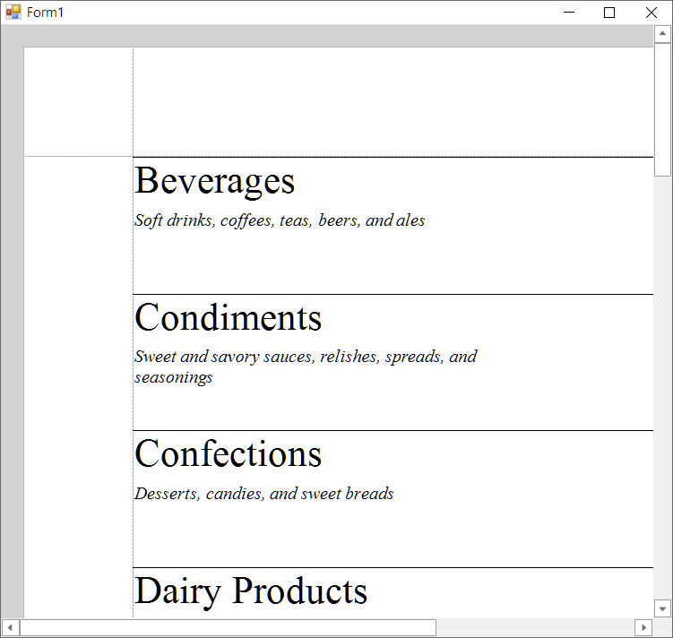

<!-- default badges list -->

<!-- default badges end -->
# Reporting for WinForms - How to Use OData (WCF Data Services) as the Report Data Source

This example gets data from the OData service with the [DataServiceQuery](https://docs.microsoft.com/en-us/dotnet/api/system.data.services.client.dataservicequery) as `IEnumerable<T>`. The report is bound to data through the [ObjectDataSource](https://docs.devexpress.com/CoreLibraries/DevExpress.DataAccess.ObjectBinding.ObjectDataSource) component.

## Files to Review

* [NorthwindModel.cs](./CS/NorthwindModel.cs)
* [XtraReport1.Designer.cs](./CS/XtraReport1.Designer.cs)

## Documentation

- [Bind Reports to Data](https://docs.devexpress.com/XtraReports/15034/detailed-guide-to-devexpress-reporting/bind-reports-to-data)
- [Getting Started with OData Client](https://docs.microsoft.com/en-us/odata/client/getting-started)

<!-- feedback -->
## Does this example address your development requirements/objectives?

 

(you will be redirected to DevExpress.com to submit your response)
<!-- feedback end -->
